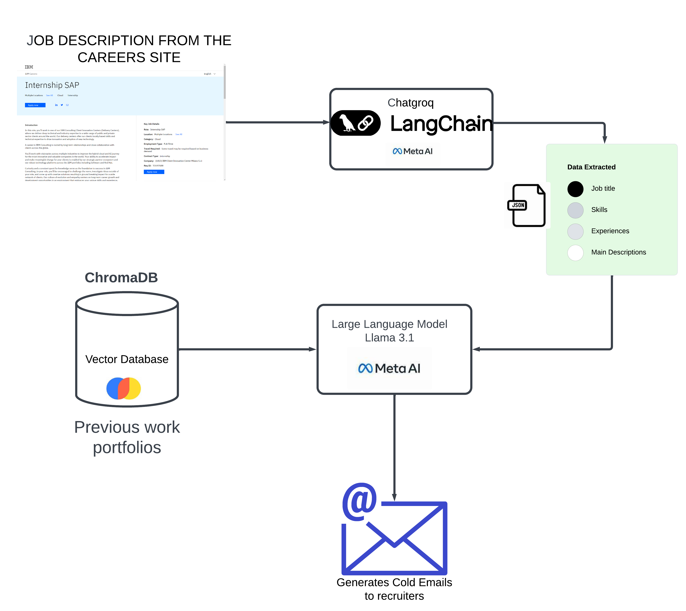
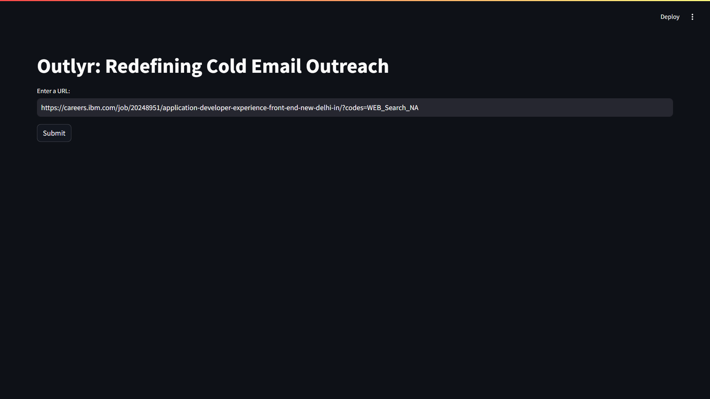
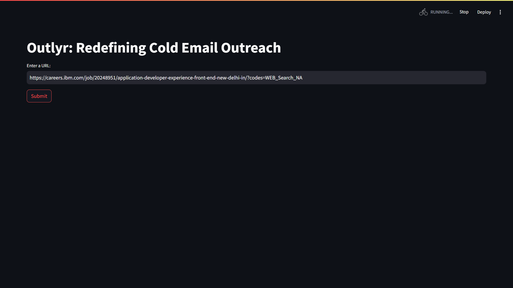
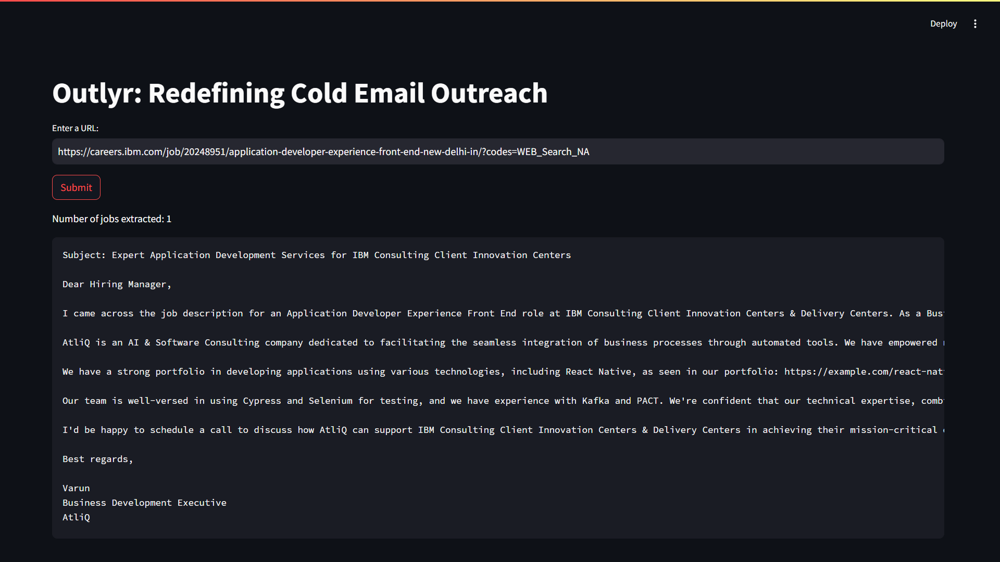

An innovative cold email generator designed for service companies, powered by Groq-Llama3.1, LangChain, and Streamlit. Simply provide the URL of a company's careers page, and the tool intelligently extracts job listings to craft highly personalized emails. Each email is enriched with portfolio links dynamically sourced from a vector database, ensuring alignment with the job's unique requirements.


## Where can it be used?
Think about Amazon putting a lot of time and effort into finding the right Principal Software Engineer. They’re not just posting job listings, but reviewing countless resumes, having in-depth interviews, and then investing in onboarding and training to make sure the new hire truly thrives in the team.

## Architecture


## Implementation



## Getting Started

Follow these steps to set up the project on your local machine.

### 1. Obtain an API Key

To use the Groq API, you need to create an API key:

- Go to [Groq API Key](https://console.groq.com/keys).
- Sign up or log in to your Groq account.
- Create a new API key and copy it.

### 2. Configure the Environment Variables

The project requires the Groq API key to interact with the Groq service. To configure the API key:

- Navigate to the `app/` folder in your project directory.
- Locate the `.env` file (you may need to create this file if it doesn't already exist).
- Add the following line to the `.env` file:
  ```text
  GROQ_API_KEY=your_api_key_here
  ```
  - Replace `your_api_key_here` with the API key you obtained in step 1.

### 3. Install Project Dependencies

Before running the app, you'll need to install the required dependencies. Make sure you have Python 3.7 or later installed.

- Open a terminal or command prompt in the root directory of the project.
- Run the following command to install all the necessary libraries:
  ```bash
  pip install -r requirements.txt
  ```

### 4. Run the Streamlit Application

Once the dependencies are installed, you can run the Streamlit app to launch the tool.

- In the terminal, execute the following command:
  ```bash
  streamlit run app/main.py
  ```
  
This will open the Streamlit application in your default web browser, and you'll be able to start generating personalized cold emails.

## Contributing

We welcome contributions! If you'd like to help improve the project, feel free to fork the repository and submit pull requests. Here are some ways you can contribute:

- Reporting bugs
- Adding new features
- Improving documentation
- Fixing issues or typos in code

To contribute, please follow these steps:
1. Fork the repository.
2. Create a new branch for your feature or bug fix.
3. Make your changes and commit them.
4. Submit a pull request with a description of your changes.

## Contact

For any questions or feedback, feel free to reach out to me [varunmayilvaganan11@gmail.com](mailto:varunmayilvaganan11@gmail.com). You can also open an issue in the GitHub repository if you encounter any problems.

---

## Acknowledgements

- [ChatGroq](https://python.langchain.com/docs/integrations/chat/groq/) for providing the API.
- [LangChain](https://www.langchain.com/) for simplifying the integration of AI models.
- [Streamlit](https://streamlit.io/) for enabling the easy creation of interactive web applications.
